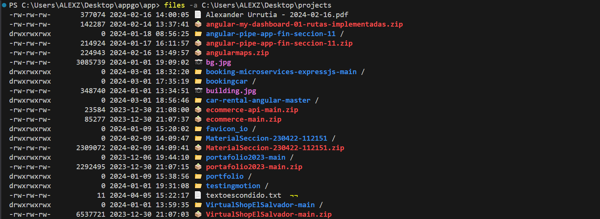

Este programa es un clon del comando de Linux ls, el cual puede ser utilizado en Linux, Windows y Mac.

Este proyecto fue hecho con el curso de EDTeam Go desde 0 2023.

Logre instalarlo en windows globalmente.

Este comando acepta las siguientes banderas:

`-a muestra todos los archivos, incluyendo los archivos ocultos`
`-n {int} limita el número de registros`
`-p {string} filtra por patrón`
`-s ordena por tamaño de archivo, el más pequeño primero`
`-t ordena por tiempo, el más antiguo primero`
`-r ordena en orden inverso mientras se ordena`

